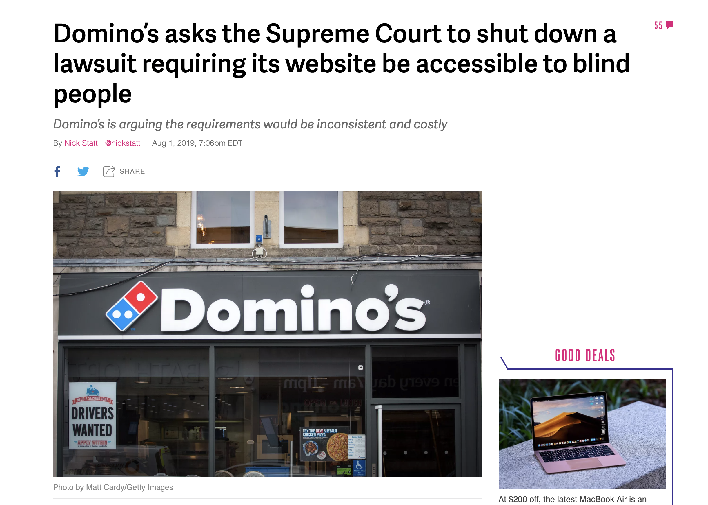
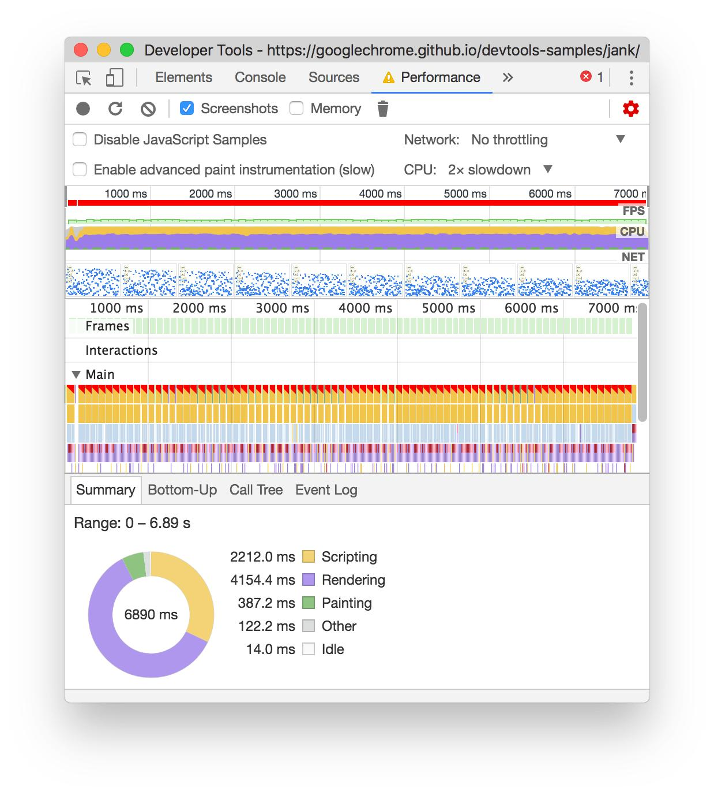
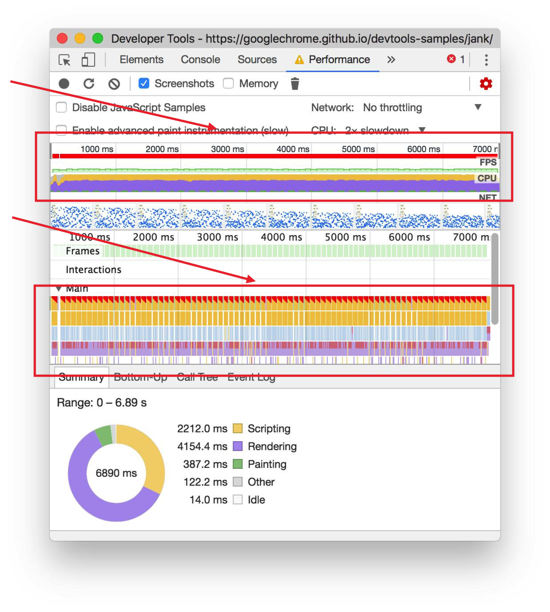
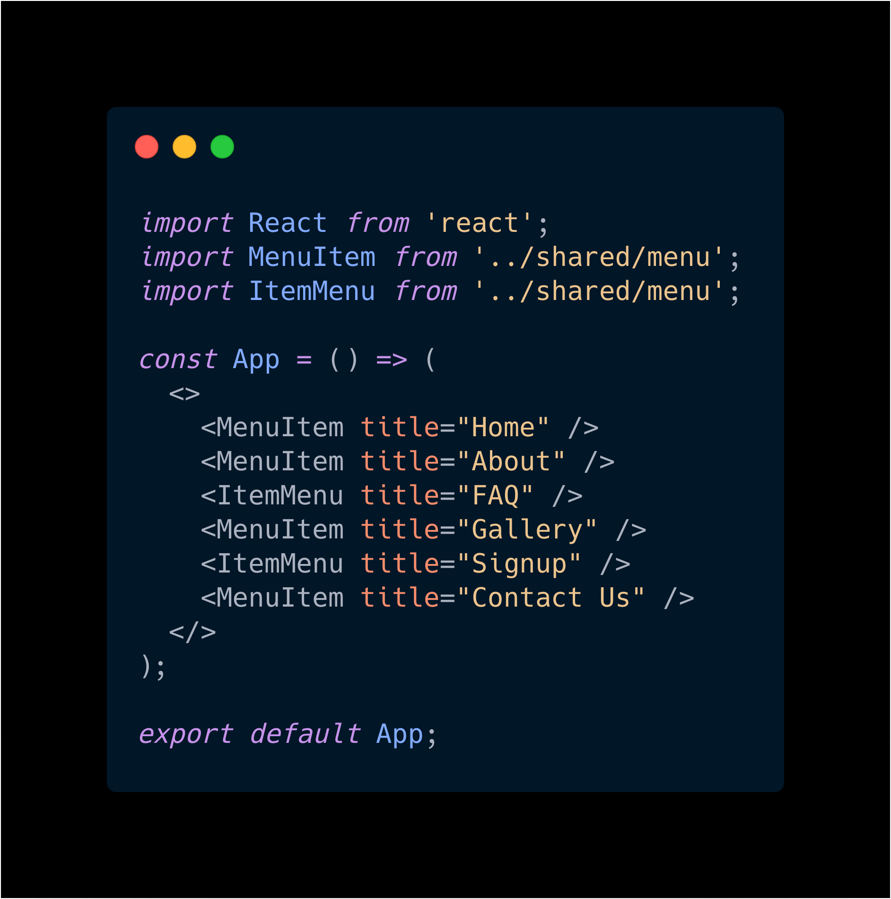

import { Head } from 'mdx-deck';
export { default as theme } from './themes/theme';
import Profile from './components/profile.jsx';
import { Appear, Image } from '@mdx-deck/components'

<Head>
  <title>A11y and React, Why its important</title>
  <meta name='twitter:site' content='@johnnyxbell' />
  <meta name='twitter:title' content='A11y &amp; React, Why its important?' />
  <link href="https://fonts.googleapis.com/css?family=Allerta+Stencil|Open+Sans" rel="stylesheet" />
</Head>

# Hello :wave:

A11y and React, Why its important?

---

# About Me

<Profile image="./assets/images/profile.png" width={150}/>

  
G’day mates, I’m Johnny

  <Appear>
    
A frontend engineer from Australia.

    
Working with the awesome team at StackShare in San Francisco.

    
Founder of Devs With Disabilities meetup.

    
Missing left arm from elbow down.

  </Appear>

---
# Find Me Online

@johnnyxbell

---

<Image
  src='./assets/images/stickers.jpeg'
  style={{
    display: 'flex',
    alignItems: 'center',
    justifyContent: 'center',
    color: 'white',
    backgroundColor: 'black',
  }}>

</Image>

---

# What am I going to chat about today?

Disabilities in tech

What is a11y, and why should you care?

Getting started with a11y and react.

---

# Before I get started lets talk about disabilities in the real world.

  <Appear>
    
We have wheelchair ramps

    
Seats on trains / buses

    
Braille

    
Disability parking

    
Pre-boarding on planes

    
... It goes on

  </Appear>

---

# Why should the digital world be different?

<Appear>
  
🤷🤷🤷🤷🤷

  
It shouldn't 🧐

</Appear>

---

# Dominos

<Appear>
  
😭😭😭😭😭😭😭😭😭😭😭

</Appear>
<a style={{fontSize: 15}}href="https://www.theverge.com/2019/8/1/20750913/dominos-pizza-website-accessible-blind-supreme-court-lawsuit">source</a>

---

# Who likes Audience Participation ?

<Appear>
  
(only a tiny bit) 🤣

</Appear>

---

# Whats the % of Americans with a disability?

<Appear>
  
5%?

  
10%?

  
20%?

</Appear>

---

# It's actually now...

<Appear>
  <h3>Closer to 25%!</h3>
  
one in 4 people

</Appear>

<a style={{fontSize: 15}}href="https://www.w3.org/WAI/business-case/">source</a>

---

# :scream: Crazy Right?

---

# Whats the first question someone asks me in a interview?

<Appear>
  
How do you type with 1 hand?

  
you guessed correctly

  
answer : With 1 hand....

  
I'd like to change that train of thought

</Appear>

___

# Who uses this daily or weekly?

<Appear>
  
Most of us right?

</Appear>

___

# So lets take a closer look at this...

Whats wrong here?

___

___

# Lets put this in a coding perspective

<Appear>
  

    
  

</Appear>

___

# Confusing Right? 🤔

___

# No Mouse

We take mouse for granted, but say you can't use one?

<Appear>
  
Demo Time

</Appear>

___

# Screen Readers

Has anyone here actully tried using their site with a screen reader?

---

# Lets give it a go...

Demo Time

---

# That was difficult wasn't it.

P.S. - I'll teach you how to fix this same site later

---

# Just the surface

Disabilities come in all shapes and sizes

I've shown just a few

___

# What is A11y?

<Appear>
  
A11y = accesibility

  
a(ccesibilit)y 11 characters so we say a11y

</Appear>

---

# Cool, but what actually is accesibility?

Accesibility is about making browsing the web easy as possible for everyone

___

# Why should you care?

Disabilities come in all shapes and sizes

Affect everyone different online

We can make a big impact, with a small amount of effort (to get started)

___

# How can I test my site for A11y issues?

Demo Time

---

# Live Coding...

😨 Bad Idea? Probably, but lets do it anyway

---

# We are hiring

---

# The end